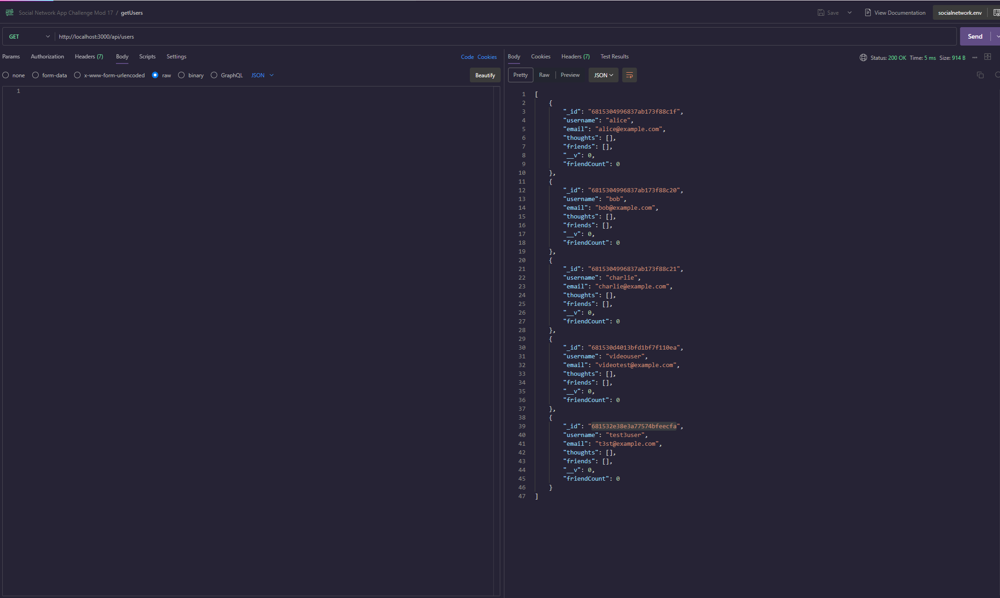
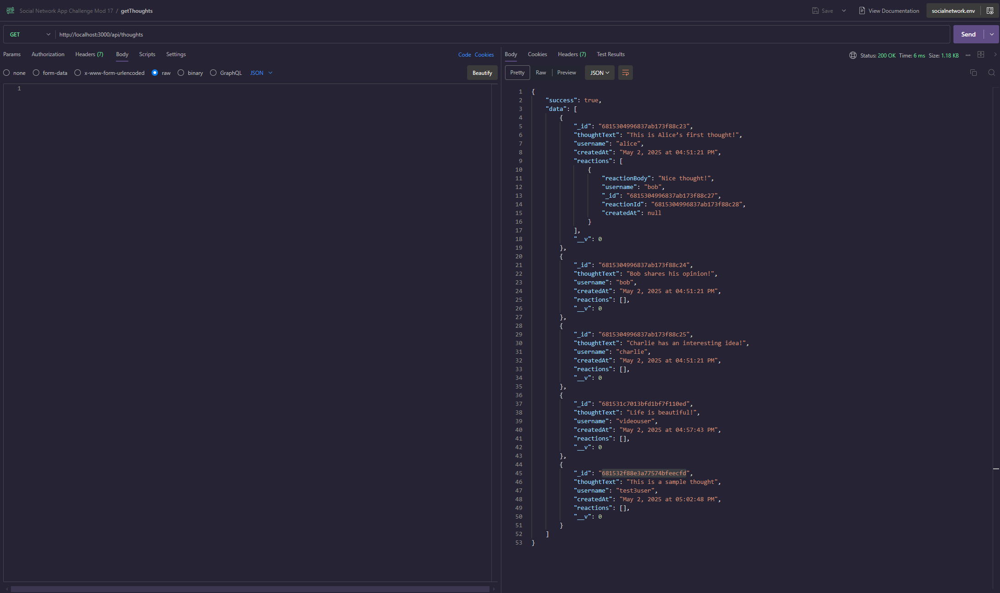
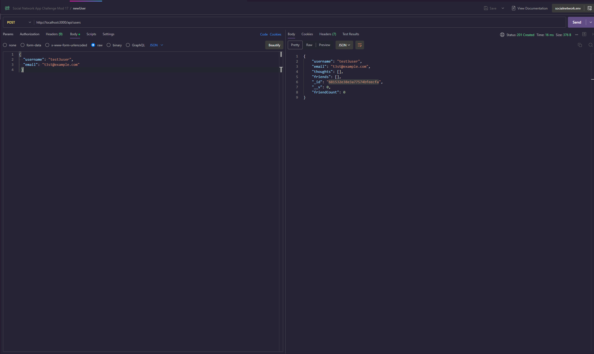
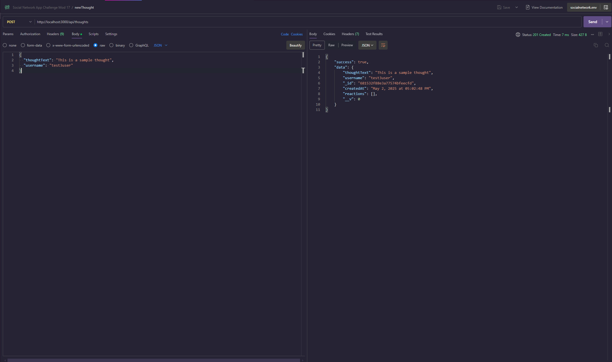
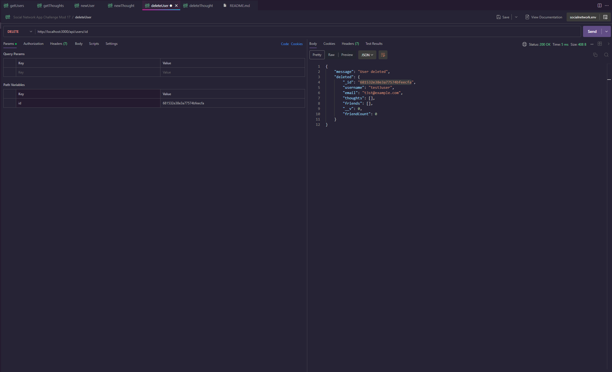
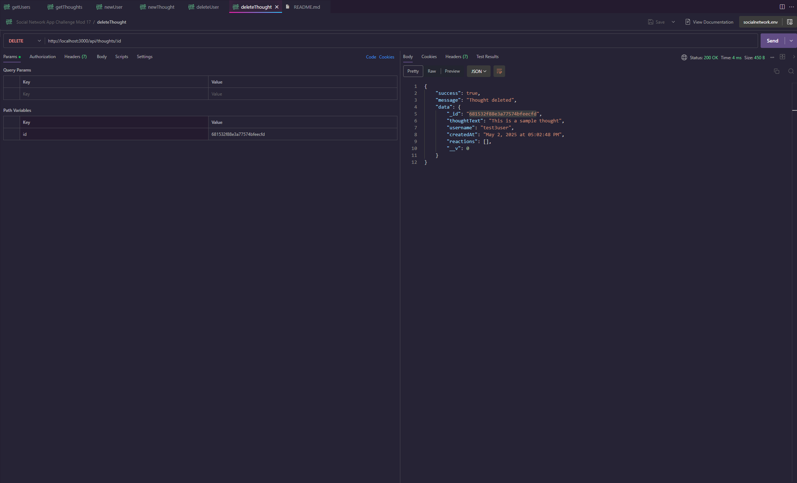

# Social Network API

[]()  
[]()  
[]()

A RESTful API for a social networking platform, built with Node.js, Express, MongoDB and TypeScript. Users can register, create “thoughts,” react to others’ thoughts, and manage a friend list. Robust validation, comprehensive testing, and clean architecture make it production-ready.

---

## Table of Contents

- [Features](#features)  
- [Tech Stack](#tech-stack)  
- [Prerequisites](#prerequisites)  
- [Installation & Setup](#installation--setup)  
- [Environment Variables](#environment-variables)  
- [Available Scripts](#available-scripts)  
- [Data Models](#data-models)  
- [API Reference](#api-reference)  
  - [User Routes](#user-routes)  
  - [Thought Routes](#thought-routes)  
  - [Reaction Routes](#reaction-routes)  
- [Database Seeding](#database-seeding)  
- [File Structure](#file-structure)  
- [Testing](#testing)  
- [Demo](#demo)
- [Contributing](#contributing)  
- [License](#license)  
- [Contact](#contact)  

---

## Features

- **User Management**: register, update profile, delete account  
- **Thoughts**: create, read, update, delete social posts (“thoughts”)  
- **Reactions**: add/remove reactions (emoji-style) on any thought  
- **Friend System**: add/remove friends, view friend lists  
- **Timestamps**: human‑friendly date formatting via a reusable utility  
- **Validation & Error Handling**: robust guardrails on all inputs  
- **Automated Testing**: Jest & Supertest for unit and integration coverage  

---

## Tech Stack

- **Runtime & Framework**: Node.js, Express.js  
- **Language**: TypeScript  
- **Database**: MongoDB (Mongoose ODM)  
- **Testing**: Jest, Supertest, mongodb-memory-server  
- **Utilities**: dotenv, cors, date formatting helper  

---

## Prerequisites

- **Node.js** v14+  
- **npm** v6+  
- **MongoDB** Atlas cluster or local instance  

---

## Installation & Setup

1. **Clone the repo**  
   ``` bash
   git clone git@github.com:Ajthompson88/social-network-app.git

   cd social-network-app   
2. **Install dependencies**

    **` npm install `**
3. **Build TypeScript**
   
    **` npm run build `**
4. **Configure Environment**

    Copy **` .env.EXAMPLE `** to **` .env `** and update the values
5. **Run in Development**
 
    **` npm run dev `**
6. **Run in Production**

    **` npm start `**

## Environment Variables

| Variable    | Description                                    |
| ----------- | ---------------------------------------------- |
| `MONGO_URI` | MongoDB connection string (Atlas or localhost) |
| `PORT`      | Port on which to run the API (default: 3000)   |

## Available Scripts

| Script                  | Command | Description                        |
| ----------------------- | ------- | ---------------------------------- |
| `npm run dev`           | —       | Run in dev mode with `ts-node-dev` |
| `npm run build`         | —       | Compile TypeScript to `dist/`      |
| `npm start`             | —       | Run compiled JS (`dist/index.js`)  |
| `npm run seed`          | —       | Seed database with sample data     |
| `npm test`              | —       | Run all Jest tests                 |
| `npm run test:watch`    | —       | Jest in watch mode                 |
| `npm run test:coverage` | —       | Generate coverage report           |

## Data Models

### User

| Field       | Type         | Description                          |
| ----------- | ------------ | ------------------------------------ |
| `username`  | `string`     | Unique, required                     |
| `email`     | `string`     | Valid email format, unique, required |
| `thoughts`  | `ObjectId[ ]` | References to Thought documents      |
| `friends`   | `ObjectId[ ]` | References to other User documents   |
| `createdAt` | `Date`       | Automatically set on creation        |

### Thought

| Field         | Type         | Description                           |
| ------------- | ------------ | ------------------------------------- |
| `thoughtText` | `string`     | 1–280 characters, required            |
| `username`    | `string`     | Creator’s username, required          |
| `createdAt`   | `Date`       | Automatically set, formatted via util |
| `reactions`   | `Reaction[ ]` | Subdocuments of Reaction schema       |

### Reaction

| Field          | Type       | Description                           |
| -------------- | ---------- | ------------------------------------- |
| `reactionId`   | `ObjectId` | Unique identifier                     |
| `reactionBody` | `string`   | 1–280 characters, required            |
| `username`     | `string`   | Reactor’s username, required          |
| `createdAt`    | `Date`     | Automatically set, formatted via util |

## API Reference 

**`Base URL: http://localhost:<PORT>/api`**

### User Routes 

| Method   | Endpoint                           | Description          |
| -------- | ---------------------------------- | -------------------- |
| `GET`    | `/users`                           | List all users       |
| `GET`    | `/users/:userId`                   | Get a user by ID     |
| `POST`   | `/users`                           | Create a new user    |
| `PUT`    | `/users/:userId`                   | Update a user’s info |
| `DELETE` | `/users/:userId`                   | Remove a user        |
| `POST`   | `/users/:userId/friends/:friendId` | Add a friend         |
| `DELETE` | `/users/:userId/friends/:friendId` | Remove a friend      |

### Thought Routes

| Method   | Endpoint               | Description          |
| -------- | ---------------------- | -------------------- |
| `GET`    | `/thoughts`            | List all thoughts    |
| `GET`    | `/thoughts/:thoughtId` | Get a thought by ID  |
| `POST`   | `/thoughts`            | Create a new thought |
| `PUT`    | `/thoughts/:thoughtId` | Update a thought     |
| `DELETE` | `/thoughts/:thoughtId` | Delete a thought     |

### Reaction Routes

| Method   | Endpoint                                     | Description                 |
| -------- | -------------------------------------------- | --------------------------- |
| `POST`   | `/thoughts/:thoughtId/reactions`             | Add a reaction to a thought |
| `DELETE` | `/thoughts/:thoughtId/reactions/:reactionId` | Remove a reaction           |

## Database Seeding

npm run seed

## File Structure

    social-network-app
    ├── src
    │   ├── controllers
    │   │   ├── userController.ts
    │   │   ├── thoughtController.ts
    │   │   └── reactionController.ts
    │   ├── models
    │   │   ├── User.ts
    │   │   ├── Thought.ts
    │   │   └── Reaction.ts
    │   ├── routes
    │   │   ├── userRoutes.ts
    │   │   ├── thoughtRoutes.ts
    │   │   └── reactionRoutes.ts
    │   ├── utils
    │   │   └── dateFormatter.ts
    │   ├── config
    │   │   └── database.ts
    │   ├── app.ts
    │   └── server.ts
    ├── tests
    │   ├── user.test.ts
    │   ├── thought.test.ts
    │   └── reaction.test.ts
    ├── .env.EXAMPLE
    ├── jest.config.js
    ├── package.json
    ├── tsconfig.json
    └── README.md


## Testing

**` npm test `**

## Demo


















Social Network App Backend [Demo Video](https://app.screencastify.com/v3/watch/aybxCVVJlAF5omCl5n0N)

## Contributing

    1. Fork the repository

    2. Create a feature branch (git checkout -b feature/YourFeature)

    3. Commit your changes (git commit -m 'Add some feature')

    4. Push to the branch (git push origin feature/YourFeature)

    5. Open a Pull Request

Please adhere to existing code style and include tests for new functionality.

## License

[MIT License](./LICENSE)

## Contact 

Andrew Thompson

- GitHub: Ajthompson88

- Email: aj.thompson8888@gmail.com